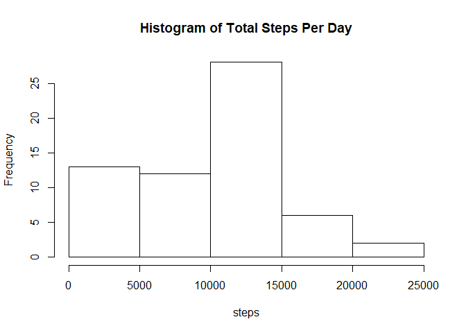
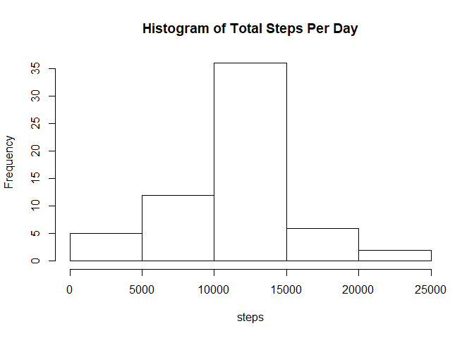
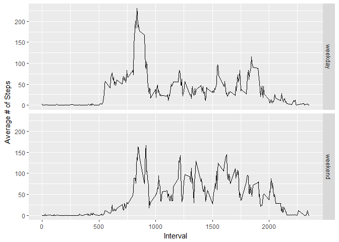

```r
library(knitr)
opts_chunk$set(echo = T)
```


## Loading and preprocessing the data
1. Load the data (i.e. read.csv())

```r
steps <- read.csv("activity/activity.csv")
```

2. Process/transform the data (if necessary) into a format suitable for your analysis

NA as of now

## What is mean total number of steps taken per day?

For this part of the assignment, you can ignore the missing values in the dataset.

1. Calculate the total number of steps taken per day

```r
steps_mean <- mean(steps$steps, na.rm = T)
steps_mean
```

```
## [1] 37.3826
```

2. Make a histogram of the total number of steps taken each day

```r
library(plyr)
library(dplyr)
```

```r
stepsPerDay <- 
    steps %>% 
    group_by(date) %>% 
    summarize(sum = sum(steps, na.rm = TRUE))

hist(stepsPerDay$sum, xlab = "steps", main = "Histogram of Total Steps Per Day")
```

<!-- -->

3. Calculate and report the mean and median of the total number of steps taken per day

```r
stepsPerDayMean <- mean(stepsPerDay$sum)
stepsPerDayMean
```

```
## [1] 9354.23
```

```r
stepsPerDayMedian <- median(stepsPerDay$sum)
stepsPerDayMedian
```

```
## [1] 10395
```

## What is the average daily activity pattern?
1. Make a time series plot (i.e. type = "l") of the 5-minute interval (x-axis) and the average number of steps taken, averaged across all days (y-axis)

```r
intervalMeans <- 
    steps %>% 
    group_by(interval) %>% 
    summarize(mean = mean(steps, na.rm = TRUE))

with(intervalMeans, plot(mean~interval, type = "l"))
```

<!-- -->

2. Which 5-minute interval, on average across all the days in the dataset, contains the maximum number of steps?

```r
maxInterval <- intervalMeans %>% filter(mean == max(mean))
maxInterval
```

```
## # A tibble: 1 x 2
##   interval  mean
##      <int> <dbl>
## 1      835  206.
```
The 5-minute interval with the maximum number of steps is 835     
It has a mean of 206.1698113 steps


## Imputing missing values
1. Calculate and report the total number of missing values in the dataset (i.e. the total number of rows with NAs)

```r
NAsum <- sum(is.na(steps$steps))
NAsum
```

```
## [1] 2304
```
The total number of NAs in the dataset is 2304.

2. Devise a strategy for filling in all of the missing values in the dataset. The strategy does not need to be sophisticated. For example, you could use the mean/median for that day, or the mean for that 5-minute interval, etc.

My chosen method is to replace the NA value with the mean for that 5-minute interval


3. Create a new dataset that is equal to the original dataset but with the missing data filled in.

```r
steps1 <- join(steps, intervalMeans, by = "interval")
head(steps1)
```

```
##   steps       date interval      mean
## 1    NA 2012-10-01        0 1.7169811
## 2    NA 2012-10-01        5 0.3396226
## 3    NA 2012-10-01       10 0.1320755
## 4    NA 2012-10-01       15 0.1509434
## 5    NA 2012-10-01       20 0.0754717
## 6    NA 2012-10-01       25 2.0943396
```

```r
steps1$steps[is.na(steps1$steps)] <- steps1$mean[is.na(steps1$steps)]
head(steps1)
```

```
##       steps       date interval      mean
## 1 1.7169811 2012-10-01        0 1.7169811
## 2 0.3396226 2012-10-01        5 0.3396226
## 3 0.1320755 2012-10-01       10 0.1320755
## 4 0.1509434 2012-10-01       15 0.1509434
## 5 0.0754717 2012-10-01       20 0.0754717
## 6 2.0943396 2012-10-01       25 2.0943396
```

```r
stepsNew <- select(steps1, steps, date, interval)
head(stepsNew)
```

```
##       steps       date interval
## 1 1.7169811 2012-10-01        0
## 2 0.3396226 2012-10-01        5
## 3 0.1320755 2012-10-01       10
## 4 0.1509434 2012-10-01       15
## 5 0.0754717 2012-10-01       20
## 6 2.0943396 2012-10-01       25
```

4. Make a histogram of the total number of steps taken each day and Calculate and report the mean and median total number of steps taken per day. Do these values differ from the estimates from the first part of the assignment? What is the impact of imputing missing data on the estimates of the total daily number of steps?

- Histogram of total number of steps taken each day

```r
stepsPerDayNew <- 
    stepsNew %>% 
    group_by(date) %>% 
    summarize(sum = sum(steps, na.rm = TRUE))

hist(stepsPerDayNew$sum, xlab = "steps", main = "Histogram of Total Steps Per Day")
```

<!-- -->

- Mean total number of steps taken per day

```r
stepsPerDayMeanNew <- mean(stepsPerDayNew$sum)
stepsPerDayMeanNew
```

```
## [1] 10766.19
```
- Median total number of steps taken per day

```r
stepsPerDayMedianNew <- median(stepsPerDayNew$sum)
stepsPerDayMedianNew
```

```
## [1] 10766.19
```

* Do these values differ from the estimates from the first part of the assignment?

```r
meanDiff <- stepsPerDayMeanNew - stepsPerDayMean
meanDiff
```

```
## [1] 1411.959
```

```r
medianDiff <- stepsPerDayMeanNew - stepsPerDayMedian
medianDiff
```

```
## [1] 371.1887
```
The difference of the means is 1411.959171     
The difference of the medians is 371.1886792

* What is the impact of imputing missing data on the estimates of the total daily number of steps?

The impact on the mean is: The statistic is higher after replacing the NA values The difference is 1411.959171           
The impact on the median is: The statistic is higher after replacing the NA values The difference is 371.1886792   

## Are there differences in activity patterns between weekdays and weekends?

###For this part the weekdays() function may be of some help here. Use the dataset with the filled-in missing values for this part.

1. Create a new factor variable in the dataset with two levels - "weekday" and "weekend" indicating whether a given date is a weekday or weekend day.

```r
library(lubridate)
weekdays <- c("Monday", "Tuesday", "Wednesday", "Thursday", "Friday")
stepsNew$weekday <- 
    factor(
        (weekdays(ymd(stepsNew$date)) %in% weekdays), 
        levels = c(TRUE, FALSE), 
        labels = c("weekday", "weekend")
    )
```

2. Make a panel plot containing a time series plot (i.e. type="l") of the 5-minute interval (x-axis) and the average number of steps taken, averaged across all weekday days or weekend days (y-axis). See the README file in the GitHub repository to see an example of what this plot should look like using simulated data.


```r
library(ggplot2)
stepsNewMean <- 
    stepsNew %>% 
    group_by(interval, weekday) %>% 
    summarize(avg = mean(steps)) 

qplot(
    interval, 
    avg, 
    data = stepsNewMean, 
    facets = weekday~., 
    geom = "line", 
    xlab = "Interval", 
    ylab = "Average # of Steps"
)
```

<!-- -->
